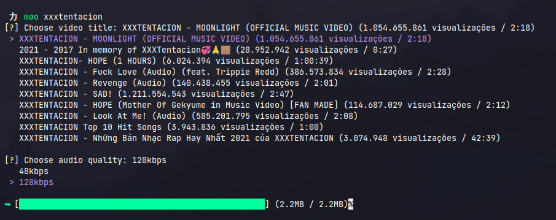
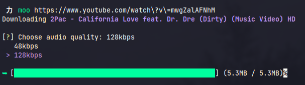
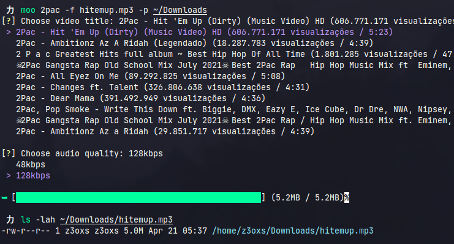

<div align="center">
    
    <h3>Download musics directly from YouTube</h3>
</div>

Download any music from YouTube just by searching or giving a URL, just moo.

## ❗️Usage (without need installation):
```bash
python3 src/moo.py
```

## ❗️ Install:

### Linux
```bash
make install
```

### Windows
1. `pip3 install -U pyinstaller`

2. `pyinstaller --onefile src/moo.py`

3. Move to executables folder and use from console.

## ❓Examples:
1. By searching:

```bash
moo xxxtentacion
```

<div align="center">
    
</div>

2. By giving a URL:

```bash
moo https://www.youtube.com/watch?v=9Y_PWYHMh4s
```

<div align="center">
    
</div>

3. Using filename and path arguments:

```bash
moo 2pac -f hitemup.mp3 -p ~/Downloads
```

<div align="center">
    
</div>
