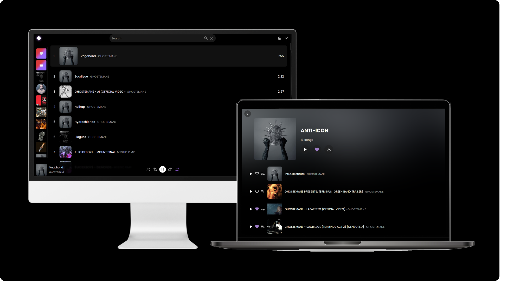

<div align="center">
    
</div>

<p align="center">
If you are tired of abusive ads, web downloaders being seized or reported, give MOO a chance!!! Lightweight, simple and objective, with the web application you can play local songs (you can download them too) or stream songs directly from YouTube, save playlists and sync your own playlists.
</p>


<br />

<div align="center">
  <h3>Desktop</h3>

  <a href="https://github.com/imf4ll/moo/tree/master/desktop">How to install and use</a>

  **Pre-builded binaries and executables (Only for desktop version):**

  | OS | Binary |
  |-------|------|
  | Linux | [Download](https://github.com/imf4ll/moo/releases/download/v0.1.4/moo-linux.zip) |
  | Windows | [Download](https://github.com/imf4ll/moo/releases/download/v0.1.4/moo-windows.zip) |
  | MacOS | Currently not supported by Wails, follow the [steps](https://github.com/imf4ll/moo/tree/master/desktop/README.md) to build  |

  **If any of these pre-builded binaries fail to run, you'll need to build manually following the [steps](https://github.com/imf4ll/moo/tree/master/desktop).**
</div>

<br />

<div align="center">
  <h3>Web</h3>

  <a href="https://github.com/imf4ll/moo/tree/master/web">How to install and use</a>
</div>

<br />

<div align="center">
  <h3>CLI</h3>
  
  <a href="https://github.com/imf4ll/moo/tree/master/cli">How to install and use</a>
</div>

<hr /> 

<br />

## 📜 Requirements:
- [Python](https://www.python.org/downloads/) (and [yt-dlp]("https://github.com/yt-dlp/yt-dlp") -> `pip install yt-dlp`) 
- [Node.JS](https://nodejs.org/)
- [Go](https://go.dev/dl/) (and [Wails]("https://wails.io/docs/gettingstarted/installation"))
- [pnpm](https://pnpm.io/pt/installation)

<br />

<a id="updating"></a>
## ♻️ Updating

#### Desktop
1. Move to root directory of moo

2. Pull and rebuild
```
$ git pull origin master

$ cd desktop/

# All builded binaries and exes are storaged on 'build' directory
$ wails build
```

#### Web
1. Move to root directory of moo

2. Pull and rebuild
```
$ git pull origin master

$ cd web/

$ pnpm run build
```

3. ONLY IF USED AS SERVICE OF SYSTEMD ON LINUX: `sudo systemctl restart moo.service`

#### CLI
1. Move to root directory of moo

2. Pull and rebuild
```
$ git pull origin master

$ cd cli/

# LINUX
$ make install

# WINDOWS
$ pyinstaller --one-file src/moo.py
```
