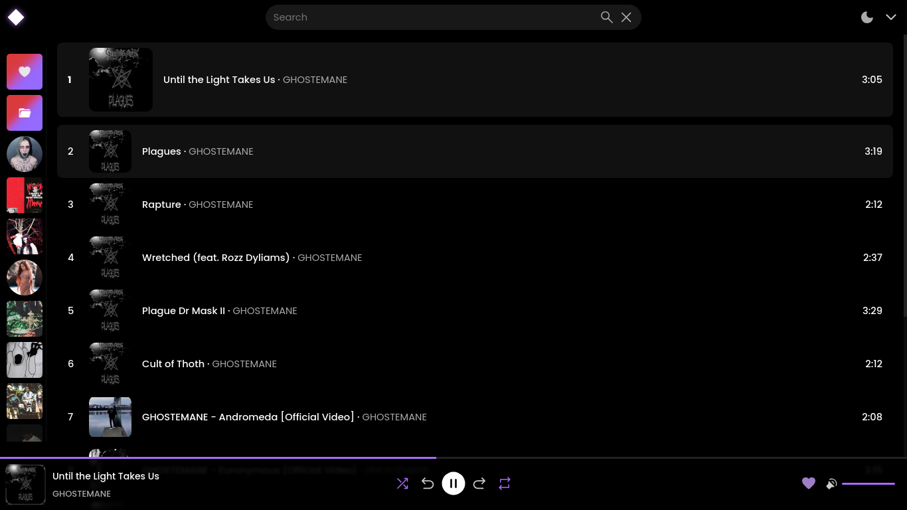

<div align="center">
  
  
  <h1>Moo...</h1>
</div>

<p align="center">
If you are tired of abusive ads, web downloaders being seized or reported, give MOO a chance!!! Lightweight, simple and objective, with the web application you can play local songs (you can download them too) or stream songs directly from YouTube, save playlists and sync your own playlists.
</p>

<div align="center">
    
</div>

<br />

<div align="center">
  <h3>Web</h3>

  <a href="https://github.com/imf4ll/moo/tree/master/web">How to install and use</a>
</div>

<br />

<div align="center">
  <h3>CLI</h3>
  
  <a href="https://github.com/imf4ll/moo/tree/master/cli">How to install and use</a>
</div>

<hr />

## 📜 Requirements:
- Python (<a href="https://github.com/yt-dlp/yt-dlp">yt-dlp</a> -> REQUIRED FOR DOWNLOADING) 
- Node.JS
- Go
- Yarn (needed to work with workspaces)

<br />

<a id="updating"></a>
## ♻️ Updating

1. Move to a directory before project directory (ex: Project directory is "/path/to/project", move to "/path/to/").
2. Run `git clone https://github.com/imf4ll/moo` to download latest version.

1. Move to root directory of moo
2. Pull and rebuild
```
$ git pull origin master

$ yarn run build
```

3. ONLY IF USED AS SERVICE OF SYSTEMD: `sudo systemctl restart moo.service`
