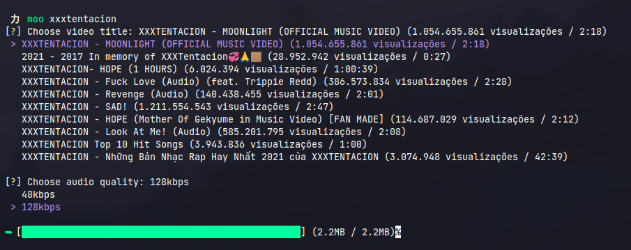
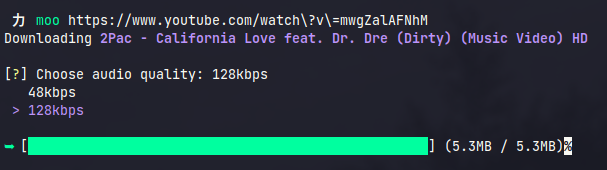
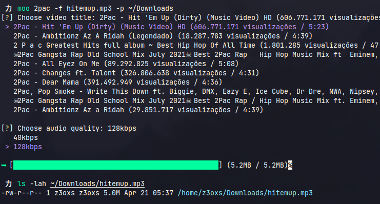

## ❗️ Install:

#### 🐧 Linux
```bash
$ cd cli/

$ make install
```

<br />

### 🪟 Windows
1. Setup installer:
```bash
$ cd cli/

$ pip3 install -r requirements.txt

$ pip3 install -U pyinstaller

$ pyinstaller --onefile src/moo.py
```

2. Move the builded .EXE to executables folder and use from console (Check your Environment Variables).

<hr />

## ❓Arguments:

<div align='center'>

| Option | Description |
|--------|-------------|
| -f, --filename | Set the filename
| -p, --path | Set the final path
| -m, --max | Set the max number of result while search
| -F, --first | Download very first result without needing choose

</div>

<br /><br/>

## ❓Examples:
1. By searching:

```bash
moo xxxtentacion
```

<div align="center">
    
</div>

<br /><br/>

2. By giving a URL:

```bash
moo https://www.youtube.com/watch?v=mwgZalAFNhM
```

<div align="center">
    
</div>

<br /><br/>

3. Using filename and path arguments:

```bash
moo 2pac -f hitemup.mp3 -p ~/Downloads
```

<div align="center">
    
</div>
